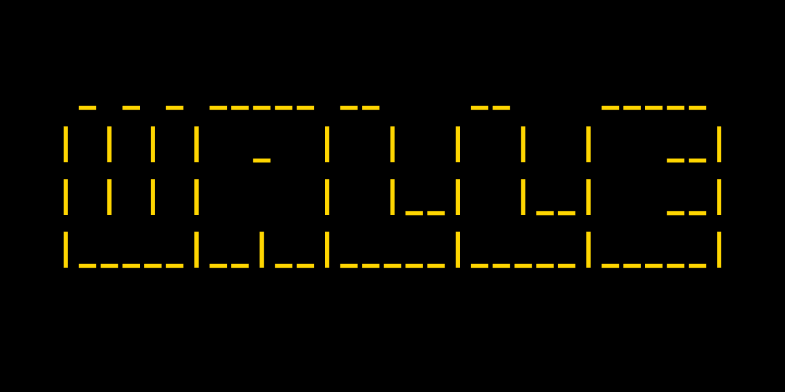
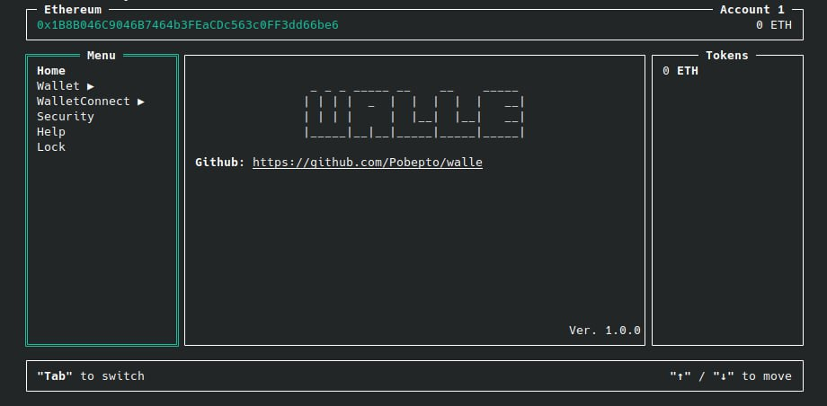
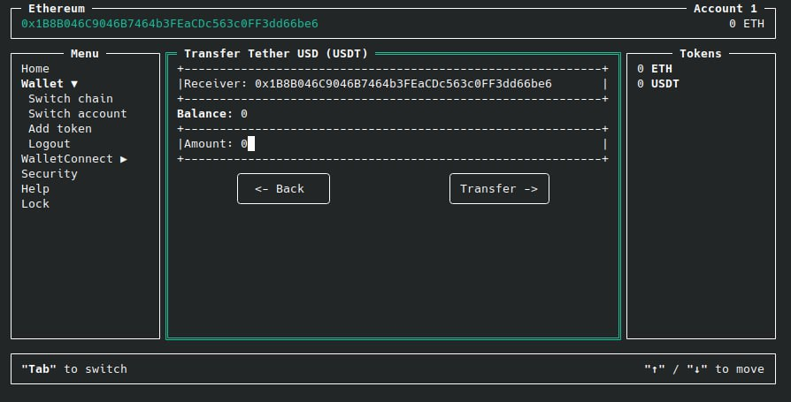
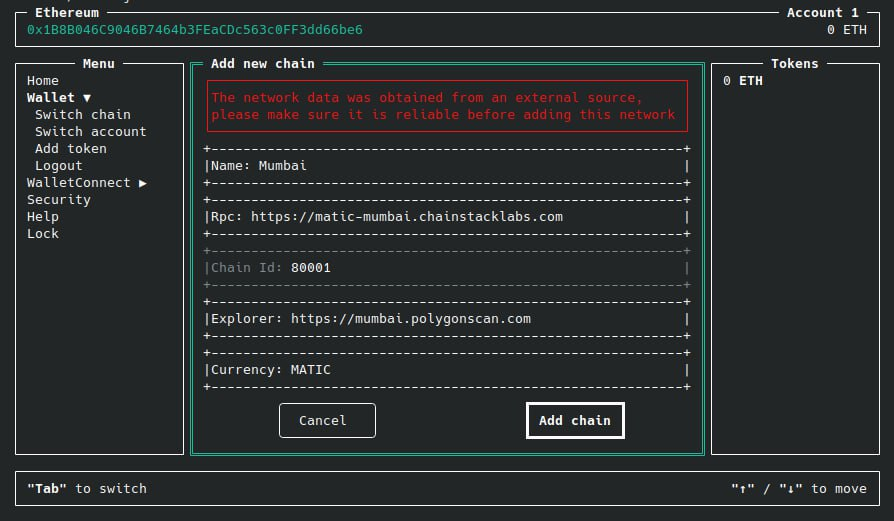
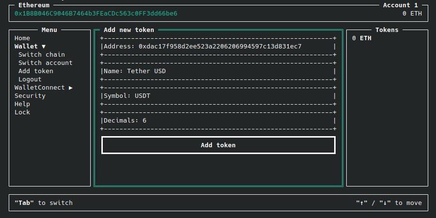
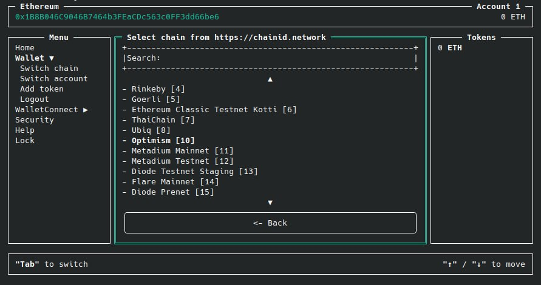
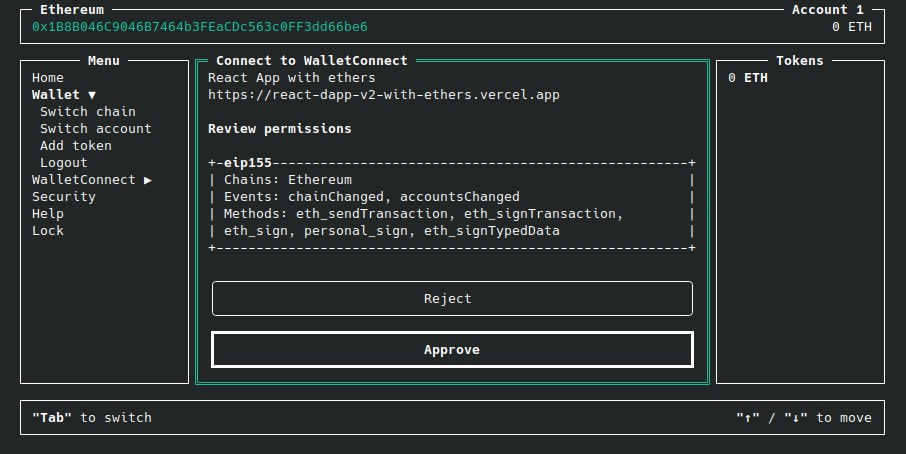
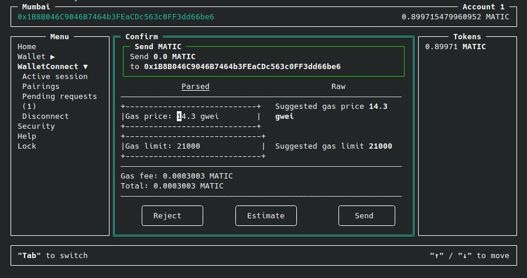
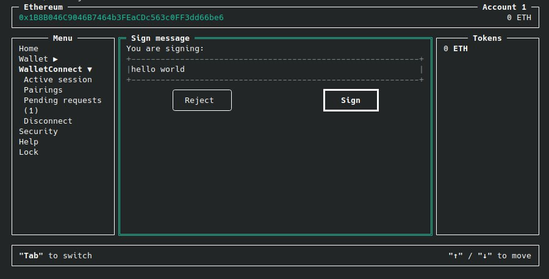

<p align="center">
  
</p>

# Walle - CLI Crypto Wallet for EVM Networks

Terminal-first wallet for everyday EVM actions: manage accounts, send native and ERC-20 transfers, and approve WalletConnect v2 requests from your command line.

[](https://www.npmjs.com/package/@walleproject/cli)
[](./LICENSE)
[](https://www.typescriptlang.org/)
[](https://walletconnect.com/)
[](https://github.com/Pobepto/walle)

## What is Walle?

Walle is a **CLI crypto wallet** and **terminal EVM wallet** for Ethereum-compatible networks.

It focuses on practical wallet workflows in terminal UI:

- wallet creation and account management
- mnemonic/private key import
- native coin and ERC-20 transfer flows
- WalletConnect v2 request handling
- custom RPC chain setup

## Screenshots










## Key Features (Implemented)

- Works with EVM chains, including custom RPC networks.
- Supports multiple wallet accounts and chain switching.
- Supports native transfers and **ERC-20 transfer** / approve flows.
- Supports transaction confirmation with **EIP-1559** gas fields.
- Supports **mnemonic/private key import**.
- Supports WalletConnect v2 session approval and request handling.
- Stores wallet data encrypted on disk using ethers wallet encryption.

## Planned Features (Roadmap)

- Better support for WalletConnect typed data signing flows.
- Expanded contract interaction UX.
- NFT-related features.
- Support for non-EVM networks.

## Installation

```bash
npm i -g @walleproject/cli
```

Alternative package managers:

```bash
yarn global add @walleproject/cli
pnpm add -g @walleproject/cli
```

## Quick Start

```bash
walle
```

- Use `Tab` to switch active panels.
- Use arrow keys (`Up` / `Down`) to navigate actions.
- Check the in-app Help section for shortcuts and flow hints.

## WalletConnect v2 Support Matrix

Current status is based on request handlers in the codebase.

| Method                   | Status        |
| ------------------------ | ------------- |
| `personal_sign`          | Supported     |
| `eth_sign`               | Supported     |
| `eth_sendTransaction`    | Supported     |
| `eth_signTransaction`    | Supported     |
| `eth_signTypedData`      | Not supported |
| `eth_signTypedData_v3`   | Not supported |
| `eth_signTypedData_v4`   | Not supported |
| `eth_sendRawTransaction` | Not supported |

## Tech Stack

- TypeScript
- Node.js CLI + Ink (React for CLIs)
- ethers.js
- WalletConnect Sign Client v2
- Zustand state management

## Developer Workflow

```bash
git clone https://github.com/Pobepto/walle.git
cd walle
npm install
```

Useful scripts:

- `npm run dev` - build in watch mode
- `npm run build` - production build
- `npm run check` - TypeScript type-check
- `npm run format` - format source files

## Security Notes

- Keep your mnemonic phrase and private keys offline and never share them.
- Use dedicated wallets for testing and limit balances in hot wallets.
- Verify recipient addresses, chain IDs, and contract addresses before confirming.
- Wallet encryption reduces risk, but local machine compromise can still expose funds.
- This project is provided **as-is**, has **no formal security audit**, and is used **at your own risk**.
- You use this software entirely at your own risk and are solely responsible for transaction outcomes and private key storage.
- See `SECURITY.md` for supported versions, vulnerability reporting, and disclaimer details.

## Contributing

Contributions are welcome.

- Open an issue for bugs or feature ideas.
- Submit a pull request with a clear description and reproduction steps (if bug fix).
- Keep changes focused and aligned with existing code style.

## License

MIT License. See `LICENSE`.
